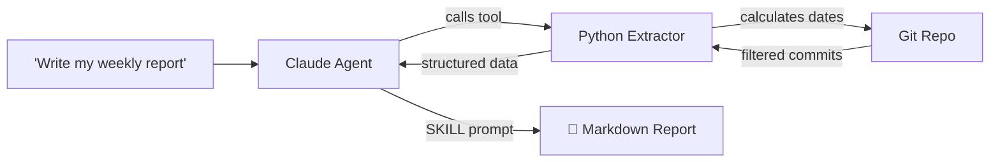

# commit-narrator

### Turn `git log` into executive-ready reports in seconds.

[](https://www.python.org/)
[](https://claude.ai/claude-code)

```
You: "Generate my weekly report"

commit-narrator: ✅ Done. 47 commits → 1 structured report with business insights.
```

---

## Before vs After

| Without commit-narrator | With commit-narrator |
|---|---|
| Scroll through `git log` for 20 minutes | Say "write my weekly report" |
| Copy-paste commits into ChatGPT | AI extracts, filters, and analyzes automatically |
| Get a commit list with no business context | Get risk assessment, effort distribution, and next-step suggestions |
| Wrong dates because LLM hallucinated "last week" | Python calculates exact date ranges — zero hallucination |

---

## See It In Action

**You say:** `Generate my weekly report`

**You get:**

> ## 📅 Tech Report (2026-05-05 ~ 2026-05-11)
>
> ### 🎯 Executive Summary
> Key deliverable: **Payment Gateway 2.0 refactor**, reducing cross-border payment latency and fixing an order-status race condition. +450 / -120 lines across 12 files, focused on feature delivery and stability.
>
> ### ✨ Detailed Changes
> **🚀 Features**
> - **Stripe Integration**: Aggregated payment API with multi-currency settlement
>
> **🐛 Bug Fixes**
> - **Connection Pool**: Resolved DB pool exhaustion under high concurrency, preventing cascading timeouts
>
> **🛠️ Infrastructure**
> - Replaced `moment.js` → `date-fns`, bundle size -200KB
>
> ### ⚠️ Risks
> - **payment/** changed 8 times this week — recommend regression testing before release
>
> ### 📊 Effort Distribution
> - 🔴 Features: ~50% · 🟡 Bug Fixes: ~30% · 🟢 Infra: ~20%
>
> ### 💡 Next Steps
> Payment module had high churn — consider adding integration tests before next sprint.

Works in **English, Chinese, or any language** — the report matches your input language.

---

## Install

In Claude Code, run these two commands:

```
/plugin marketplace add wqvbjhc/commit-narrator
/plugin install commit-narrator
```

That's it. Now open any Git repo and ask for a report.

<details>
<summary>Manual installation</summary>

```bash
git clone https://github.com/wqvbjhc/commit-narrator.git

# Global (available everywhere)
cp -r commit-narrator/skills/commit-narrator ~/.claude/skills/

# Or project-level (this repo only)
mkdir -p .claude/skills
cp -r commit-narrator/skills/commit-narrator .claude/skills/
```

Requires: Python 3.8+, Git

</details>

---

## How To Use

### In Claude Code — just talk

```
> Write my weekly report
> 写一份本周周报
> What did the team ship last month?
> Sprint summary for the past two weeks
> Quarterly review for john@company.com
```

### As a standalone CLI

Run inside any Git repository directory:

```bash
# cd into your project first
cd /path/to/your/git/project

python3 /path/to/commit-narrator/scripts/git_extractor.py --period this_week
python3 /path/to/commit-narrator/scripts/git_extractor.py --period last_month --author all
python3 /path/to/commit-narrator/scripts/git_extractor.py --since 2026-01-01 --until 2026-03-31
```

---

## What Makes It Different

| Problem | How commit-narrator Solves It |
|---|---|
| **LLMs hallucinate dates** | Python calculates exact `start_date` / `end_date` — never wrong |
| **Token explosion** | Auto-filters lock files, images, build artifacts + 50K char circuit breaker |
| **Commit spam** | Merges related commits into cohesive narratives with business context |
| **No risk awareness** | Flags high-churn modules, large hotfixes, stability concerns |
| **Manual effort** | One sentence in, structured report out |

---

## How It Works



## Parameters

| Parameter | Description | Values |
|-----------|-------------|--------|
| `--period` | Relative time range (recommended) | `today` `yesterday` `this_week` `last_week` `this_month` `last_month` `this_quarter` `last_quarter` `this_year`. **Default: `this_week`** if no period or date range specified |
| `--author` | Filter by contributor | name, email, `all`, `team`, or `everyone` (`all`/`team`/`everyone` all return unfiltered results) |
| `--since` | Exact start date | `YYYY-MM-DD` |
| `--until` | Exact end date | `YYYY-MM-DD` |

## Roadmap

- [x] Smart Git log extraction & filtering
- [x] Python-native date calculation (no LLM hallucination)
- [x] CTO-perspective prompt engineering
- [x] Quarterly & monthly report support
- [ ] `--compact` mode (stats only, save tokens)
- [ ] Code contribution heatmap
- [ ] PPT report export
- [ ] Slack / Feishu / Teams integration

## Contributing

PRs and issues welcome — especially better prompt strategies and filter rules.

## 更新记录

- 2026-06-11 AI 自动扫描更新：补充 `--period` 默认行为（this_week）和 `--author` 隐藏值（team/everyone）

## License

MIT © 2026 wqvbjhc
