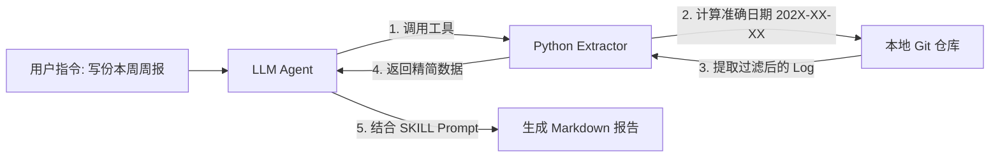

# 🤖 GitPulse-AI: Intelligent Git Report Generator

[](https://opensource.org/licenses/MIT)
[](https://www.python.org/)
[](https://github.com/topics/agent)

> **"Stop writing weekly reports manually. Let AI explain your code."**
>
> 拒绝编造周报。GitPulse-AI 是一个**基于 LLM 的智能研发汇报助手**。它通过 Python 中间件精准提取 Git 历史，结合 CTO 视角的 Prompt 工程，自动生成具备**业务价值**和**技术深度**的工作总结。

## ✨ 核心痛点解决 (Why this?)

大多数 AI 写周报的工具存在两个致命问题：
1.  **时间幻觉 (Time Hallucination)**：LLM 经常搞不清 "上周" 具体是几号到几号。
2.  **上下文爆炸 (Context Overflow)**：直接把 `git log` 丢给 AI，Token 瞬间耗尽，且包含大量 `package-lock.json` 等噪音。

**GitPulse-AI 的解决方案：**
*   ✅ **Python 宿主计算日期**：由脚本计算精准的 `start_date` 和 `end_date`，杜绝年份错误。
*   ✅ **智能降噪与熔断**：自动过滤非业务文件，并内置字符熔断机制，保护你的 Token 额度。
*   ✅ **深度业务推断**：不仅仅是罗列 Commit，而是通过 `diff stat` 和 `body` 分析代码背后的业务价值（稳定性、架构优化等）。

## 🛠️ 架构原理



## 🚀 快速开始

### 1. 环境准备
确保你的环境中安装了 Python 3 和 Git。

```bash
git clone https://github.com/your-username/GitPulse-AI.git
cd GitPulse-AI
chmod +x git_extractor.py
```

### 2. 作为命令行工具使用 (CLI)
你可以在任何 Git 仓库目录下直接运行脚本，获取清洗后的数据（用于手动喂给 ChatGPT/Claude）：

```bash
# 获取本周数据（自动计算日期）
./git_extractor.py --period this_week

# 获取指定人员数据
./git_extractor.py --period last_week --author "zhangsan"

# 获取全员数据（Team Leader 模式）
./git_extractor.py --period this_month --author all
```

### 3. 作为skills方法

#### 方法 1：全局安装（推荐）

将 skill 复制到用户的全局 skills 目录：

```bash
cp -r templates/.claude/skills/news ~/.claude/skills/
```

#### 方法 2：项目级别安装

将 skill 复制到项目的 `.claude/skills/` 目录：

```bash
mkdir -p .claude/skills
cp -r templates/.claude/skills/news .claude/skills/
```

#### 方法 3：从模板创建

如果你正在使用这个模板仓库，可以直接引用：

```bash
# 在你的项目中
ln -s /path/to/claude-init/templates/.claude/skills/news ~/.claude/skills/news
```

## 📊 报告效果示例

**用户指令**：`生成本周的周报`

**Agent 输出**：

> ## 📅 阶段性技术报告 (本周 Review)
>
> ### 1. 🎯 核心成果概览
> 本周重点完成了 **支付网关 2.0 的重构**，显著降低了跨国支付的延迟，并修复了订单状态同步的竞态条件问题。
>
> ### 2. ✨ 详细变更分析
> *   **🆕 新特性 (Features)**
>     *   **Stripe 集成**：新增聚合支付接口，支持多币种结算。
> *   **🐛 稳定性 (Bug Fixes)**
>     *   **死锁修复**：解决了高并发下数据库连接池耗尽的问题。
> *   **🛠️ 工程化**
>     *   移除 `moment.js`，替换为 `date-fns`，包体积减少 200kb。
>
> ### 3. 📈 数据统计
> *   **变更文件**: 12 个
> *   **代码变动**: +450 lines / -120 lines

## ⚙️ 参数说明

| 参数 | 描述 | 示例 |
| :--- | :--- | :--- |
| `--period` | **(推荐)** 相对时间范围，自动计算日期 | `today`, `yesterday`, `this_week`, `last_week`, `this_month` |
| `--author` | 作者筛选，支持模糊匹配或 "all" | `john`, `all` |
| `--since` | 自定义开始日期 | `2024-01-01` |
| `--until` | 自定义结束日期 | `2024-01-31` |

## 🗺️ Roadmap

- [x] 基础 Git Log 提取与清洗
- [x] 智能日期计算 (Python Native)
- [x] SKILL Prompt 模板 v1.0
- [ ] **增强**: 支持提取详细信息
- [ ] **增强**: 支持作成PPT报告
- [ ] **增强**: 支持发送到群聊
- [ ] **优化**: 增加 `--compact` 模式 (仅统计不带 diff) 以节省大量 Token
- [ ] **分析**: 增加"代码贡献热力图"数据输出

## 🤝 Contributing

欢迎提交 Issue 和 Pull Request！如果你有更好的 Prompt 策略或过滤规则，请分享出来。

## 📄 License

MIT License © 2026 wqvbjhc
